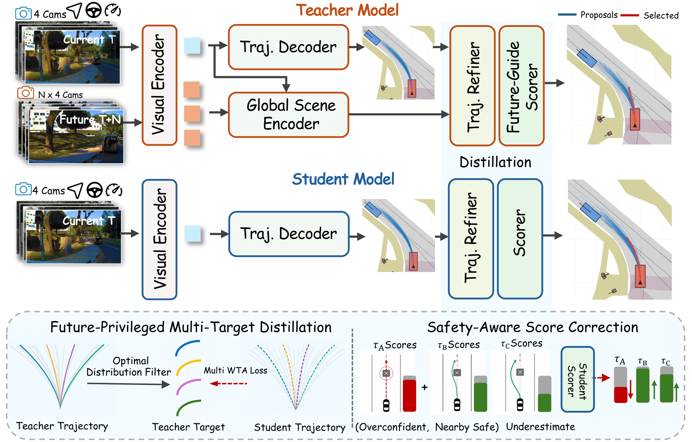

<h1 align="center">FPD-Drive: Future Policy Distillation for<br>End-to-End Autonomous Driving</h1>

<p align="center">
  Li-Heng Chen<sup>1,2,*</sup>,
  Qifeng Chen<sup>1,*,†</sup>,
  Chengwei Wu<sup>1</sup>,
  Yingjie Zhang<sup>1</sup>,
  Sheng Yang<sup>1</sup>,
  Hongbo Fu<sup>2,✉</sup>,
  Shaoqing Ren<sup>1,3,✉</sup>
</p>

<p align="center">
  <sup>1</sup> NIO<br>
  <sup>2</sup> The Hong Kong University of Science and Technology<br>
  <sup>3</sup> University of Science and Technology of China
</p>

<p align="center"><sup>*</sup> Equal contribution. &nbsp; <sup>†</sup> Project lead. &nbsp; <sup>✉</sup> Corresponding authors.</p>

<p align="center">
  <a href="#overview">Overview</a> •
  <a href="#results">Results</a> •
  <a href="#citation">Citation</a>
</p>

## Overview

**FPD-Drive transfers privileged future knowledge into a visual driving policy to improve both trajectory generation and selection.** A teacher uses recorded future observations during training to provide diverse, high-quality trajectory targets. A student learns from these targets and from evaluated safety outcomes of its own candidates. At deployment, the student plans using four current camera views, available ego-state history, and a navigation command, without future observations or teacher inference.

A logged driving scene contains only one executed trajectory and its associated future observations, leaving other valid behaviors weakly supervised. FPD-Drive addresses this limitation with two complementary objectives:

- **Future-Privileged Multi-Target Distillation** expands supervision beyond a single demonstration by transferring multiple safe, geometrically distinct teacher trajectories.
- **Safety-Aware Score Correction** improves candidate selection by correcting overconfident unsafe predictions and increasing confidence in underestimated safe alternatives.

The unscaled FPD-Drive achieves **94.88 PDMS** on NAVSIM v1, **54.75 EPDMS** on NAVSIM v2, and a preliminary **45.1 HD-Score** on HUGSIM. The scaled **FPD-Drive-Pro** achieves **95.51 PDMS** and **58.07 EPDMS** on NAVSIM v1 and v2, respectively.

<p align="center">
  <a href="assets/Overview.pdf">
    
  </a>
</p>

<p align="center"><em>FPD-Drive framework. Future observations support teacher training and target generation; only the student is used at deployment.</em><br><a href="assets/Overview.pdf">View the framework figure as a PDF</a></p>


## Results

All scores below are on a 0-100 scale; higher is better. FPD-Drive-Pro denotes the scaled model.

| Model         | NAVSIM v1`navtest` PDMS | NAVSIM v2`navhard_two_stage` EPDMS | HUGSIM RC | HUGSIM HD-Score |
| :------------ | ------------------------: | -----------------------------------: | --------: | --------------: |
| FPD-Drive     |                     94.88 |                                54.75 |      55.3 |            45.1 |
| FPD-Drive-Pro |           **95.51** |                      **58.07** |         - |               - |

NAVSIM v2 EPDMS is the combined score returned by the two-stage evaluator. The reported FPD-Drive evaluation covers **225 scenario groups and 5,912 scenarios**. HUGSIM results are **preliminary**, covering **345 scenarios**. A dash indicates an unreported result.

### NAVSIM v1 metric breakdown

| Model         |    NC |   DAC |    EP |   TTC | Comfort |            PDMS |
| :------------ | ----: | ----: | ----: | ----: | ------: | --------------: |
| FPD-Drive     | 99.16 | 99.46 | 91.31 | 97.50 |   99.99 |           94.88 |
| FPD-Drive-Pro | 99.29 | 99.32 | 93.09 | 97.36 |   99.98 | **95.51** |

NC: no-at-fault collision; DAC: drivable-area compliance; EP: ego progress; TTC: time-to-collision compliance; PDMS: Predictive Driver Model Score; EPDMS: Extended PDMS.

### HUGSIM closed-loop evaluation

| Metric                | Easy | Medium | Hard | Extreme | Reported average |
| :-------------------- | ---: | -----: | ---: | ------: | ---------------: |
| Route completion (RC) | 86.2 |   62.8 | 38.2 |    43.3 |   **55.3** |
| HD-Score              | 78.5 |   57.0 | 25.2 |    28.1 |   **45.1** |


## Citation

```bibtex
@misc{chen_fpddrive,
  title  = {{FPD-Drive}: Future Policy Distillation for End-to-End Autonomous Driving},
  author = {Chen, Li-Heng and Chen, Qifeng and Wu, Chengwei and Zhang, Yingjie
            and Yang, Sheng and Fu, Hongbo and Ren, Shaoqing},
  note   = {Manuscript}
}
```
